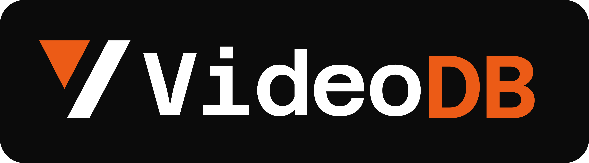

<!-- PROJECT SHIELDS -->
[![Python][python-shield]][python-url]
[![MCP][mcp-shield]][mcp-url]
[![uv][uv-shield]][uv-url]
[![Stargazers][stars-shield]][stars-url]
[![Issues][issues-shield]][issues-url]
[![Website][website-shield]][website-url]

<br />
<p align="center">
  <a href="https://videodb.io/"></a>
</p>

<h1 align="center">VideoDB Record & Replay</h1>

<p align="center">
  Record desktop workflows once. Compile them into reusable agent skills.
  <br />
  <br />
  <strong>Record &rarr; Compile &rarr; Give the skill to your agent</strong>
</p>

<p align="center">
  <a href="#installation">Install</a>
  ·
  <a href="#features">Features</a>
  ·
  <a href="#how-it-works">How It Works</a>
  ·
  <a href="https://docs.videodb.io"><strong>Docs</strong></a>
  ·
  <a href="https://github.com/video-db/open-record-replay/issues">Report Bug</a>
</p>

---

## What is Record & Replay?

An MCP server that records a human-operated desktop workflow and compiles it into reusable skill files. The generated `SKILL.md` can then be given to an agent so the agent can perform the workflow later.

- **Record** — Captures native accessibility events, typed values, target metadata, and optional screen video to VideoDB for visual reference.
- **Compile** — An LLM transforms the event log and scene descriptions into reusable `SKILL.json` and human-readable `SKILL.md` files.
- **Use** — The server installs the generated `SKILL.md` into the agent's global skills directory, where future agent runs can use the skill instructions, inputs, verification checks, and execution guidance.

Demonstrate a task once on screen, and the server produces a self-contained, versioned skill artifact. This repo does not include a replay engine; replay is performed by the agent that consumes the generated skill.

---

## Demo

https://github.com/user-attachments/assets/5ec93a7a-f285-4265-99a7-4ea60349b0ee

---

## Installation

### Prerequisites

- Python 3.10+
- [uv](https://docs.astral.sh/uv/) package manager
- A [VideoDB](https://console.videodb.io) API key

### 1. Clone and install

```bash
git clone https://github.com/video-db/open-record-replay.git
cd open-record-replay
uv sync
```

### 2. Set your API key

Create a `.env` file in the project root:

```env
VIDEODB_API_KEY=your_VIDEODB_API_KEY
```

### 3. Configure your MCP client

Add to your MCP config (`claude_desktop_config.json`, VS Code MCP settings, etc.):

```json
{
  "mcpServers": {
    "videodb-record-replay": {
      "command": "uv",
      "args": ["run", "python", "server.py"],
      "cwd": "/path/to/open-record-replay"
    }
  }
}
```

### 4. Restart your client

Five tools and two resources will appear. You're ready to record.

<details>
<summary><strong>Platform-specific setup</strong></summary>

**macOS** — Requires Screen Recording, Microphone, Accessibility, and Input Monitoring permissions. Run the permission helper first:

```bash
uv run python scripts/smoke_macos_hook.py --prompt-permissions
```

If `ready_for_event_recording` is false, enable the terminal process in **System Settings > Privacy & Security > Accessibility** and **Input Monitoring**, then rerun.

**Windows** — Uses UI Automation. No additional setup required beyond the standard install.

**Linux** — Uses AT-SPI. Ensure `at-spi2-core` is installed and your desktop environment has accessibility enabled.

</details>

---

## Usage

Recording is human-in-the-loop. The agent starts recording, announces that recording is active, then waits. The human operator performs the UI workflow being captured.

```
record_skill_tool("my-workflow", lead_in_seconds=5)
    → Agent tells the operator recording is active
    → Operator switches to the target app and performs the workflow
    → Operator returns to the MCP client and says "stop"
    → Agent calls stop_recording_tool(trim_end_seconds=10)
    → Agent calls compile_skill_tool(video_id, "my-workflow")
    → Agent verifies/reports global_skill_md_path for future use
```

<details>
<summary><strong>lead_in_seconds</strong></summary>

The recorder starts capture immediately, then the compiler ignores events before the effective workflow start. With `lead_in_seconds=5`, the operator can switch from the MCP client to the target app and should begin the demonstrated workflow after 5 seconds.

</details>

<details>
<summary><strong>trim_end_seconds</strong></summary>

Discards events at the tail of the recording. Use when the operator must switch back to the MCP client to say "stop". For example, `trim_end_seconds=10` ignores the final 10 seconds so the generated skill does not include the operator returning to the terminal or chat window.

</details>

<details>
<summary><strong>Events-only mode</strong></summary>

If VideoDB screen capture is unavailable, the system falls back to recording native accessibility events only. Call `compile_skill_tool` with `video_id=""` or `video_id="none"` to compile from events alone.

</details>

---

## How It Works

```
Human performs workflow
        |
        v
+------------------------------------------------------------------+
| Native AX/UIA/AT-SPI hooks -> events.jsonl                       |
| VideoDB Capture SDK -> video_id, when capture succeeds           |
+------------------------------------------------------------------+
        |
        v
+------------------------------------------------------------------+
| Compiler                                                         |
| events.jsonl + optional scene summaries/transcript -> SKILL.json |
| SKILL.json -> SKILL.md                                           |
+------------------------------------------------------------------+
        |
        v
+------------------------------------------------------------------+
| Agent skill install                                              |
| ~/.mcp-videodb/skills/<name>/SKILL.md                            |
| ~/.codex/skills/<name>/SKILL.md, unless overridden               |
+------------------------------------------------------------------+
```

The accessibility hooks provide the action log. VideoDB scene indexing adds visual context when screen capture is available. The compiler combines those signals into skill files that a future agent can use to perform the workflow.

---

## Features

| Feature | Description |
|---------|-------------|
| **Dual recording** | Captures native accessibility events and, when full capture is available, screen video for visual reference |
| **LLM compilation** | VideoDB scene indexing and `generate_text` compile event logs, scene descriptions, and transcript text into structured `SKILL.json` |
| **Graceful degradation** | Falls back to events-only recording when screen capture is unavailable |
| **Cross-platform** | Native accessibility hooks for Windows (UIA), macOS (AX), and Linux (AT-SPI) |
| **Skill versioning** | Auto-increments on recompile; archives old versions as `SKILL.vN.json` |
| **Variable templating** | Prompts the compiler to turn recorded literals such as search queries, dates, dropdown choices, and file paths into reusable inputs |
| **Human-in-the-loop** | Recording is operator-driven, not agent-driven — the human demonstrates, the AI learns |

---

## Tools

| Tool | Parameters | Description |
|------|-----------|-------------|
| `request_capture_permissions_tool` | — | Request microphone and screen capture permissions before recording |
| `record_skill_tool` | `name: str`, `lead_in_seconds: float = 0.0` | Start a human-in-the-loop workflow recording |
| `stop_recording_tool` | `trim_end_seconds: float = 0.0` | Stop the active recording and export video to VideoDB when capture is available |
| `compile_skill_tool` | `video_id: str`, `name: str` | Compile a recording into `SKILL.json` and `SKILL.md`, then install `SKILL.md` globally for future agent use |
| `list_skills_tool` | — | List all skills generated through this MCP |

### Resources

| Resource | Description |
|----------|-------------|
| `skills://list` | List all available skills as JSON |
| `skills://{name}/content` | Load a skill's `SKILL.md` into the agent context |

---

## Skill Output

Compiled skills land in `~/.mcp-videodb/skills/<name>/`:

| File | Purpose |
|------|---------|
| `SKILL.json` | Structured skill definition with steps, inputs, verification checks, recorded surface data, and execution strategy |
| `SKILL.md` | Human and agent-readable markdown following the agentskills.io standard |
| `SKILL.vN.json` | Archived previous versions on recompile |

Every generated `SKILL.json` includes an `execution_strategy` — `web_browser`, `desktop_app`, `hybrid`, `terminal`, `file_system`, or `unknown` — so the agent consuming the skill knows which tool path to prefer. Every `SKILL.md` includes execution guidance, continuous improvement guidance, and agent tool-priority guidance.

After `SKILL.md` is created, `compile_skill_tool` also installs it into the
agent's global skills directory, `~/.codex/skills/<name>/SKILL.md` by default,
and returns `global_skill_md_path` plus an `agent_instruction` reminding the
agent to verify or report the global install. Agents should ensure this global
install step has happened so the skill is available in future runs. Set
`CODEX_HOME` to change the base Codex directory, or set
`AGENT_GLOBAL_SKILLS_ROOT` to override the global skills directory directly.

---

## Architecture

```
open-record-replay/
├── server.py                 # FastMCP entry point, tool and resource definitions
├── state.py                  # Shared server state singleton
├── config.py                 # Constants, .env loading
├── registry.py               # Skill CRUD + versioning
│
├── capture/
│   ├── recorder.py           # Records native accessibility events + optional VideoDB capture
│   ├── ax_client.py          # JSONL IPC wrapper for native accessibility companion
│   ├── capture_client.py     # VideoDB Capture SDK wrapper
│   └── native/
│       ├── ax_hook_win32.py   # Windows: UI Automation + keyboard polling + TCP IPC
│       ├── ax_hook_darwin.py  # macOS: Accessibility API + pynput + pipe IPC
│       └── ax_hook_linux.py   # Linux: AT-SPI + pynput + pipe IPC
│
├── compiler/
│   ├── compiler.py           # LLM compilation: index scenes → match events → prompt → normalize
│   ├── prompts.py            # LLM system prompt for structured skill generation
│   ├── md_generator.py       # Converts SKILL.json to agent-readable SKILL.md
│   ├── tool_manifest.py      # Surface-to-tool mapping for replay guidance
│   └── recommended_tools.json
│
├── schema/
│   └── skill.schema.json     # JSON Schema (draft-07) for SKILL.json validation
│
├── scripts/
│   └── smoke_macos_hook.py   # macOS AX hook permission helper
```

---

## Troubleshooting

<details>
<summary><strong>Recording won't start</strong></summary>

- Verify `VIDEODB_API_KEY` is set in `.env` and is valid
- Run `request_capture_permissions_tool` and approve any permission prompts
- On macOS, check Screen Recording and Accessibility permissions
- Check that no other application is using the accessibility hook

</details>

<details>
<summary><strong>Compilation fails or returns empty steps</strong></summary>

- Ensure the recording has meaningful UI interactions (not just idle time)
- Try events-only compilation (`video_id=""`) if video indexing is slow
- The LLM may need another generation attempt — the compiler is configured for up to 2 attempts

</details>

<details>
<summary><strong>Permission prompts not appearing on macOS</strong></summary>

```bash
# Reset permissions and try again
uv run python scripts/smoke_macos_hook.py --prompt-permissions
```

If `ready_for_event_recording` is false, manually enable the terminal in **System Settings > Privacy & Security > Accessibility** and **Input Monitoring**.

</details>

<details>
<summary><strong>Windows: no keyboard events recorded</strong></summary>

- Ensure the app being recorded has UI Automation support (most modern apps do)

</details>

---

## Community & Support

- **Docs**: [docs.videodb.io](https://docs.videodb.io)
- **Issues**: [GitHub Issues](https://github.com/video-db/open-record-replay/issues)
- **Discord**: [Join the VideoDB community](https://discord.gg/py9P639jGz)
- **API Key**: [console.videodb.io](https://console.videodb.io)

---

<p align="center">Made with ❤️ by the <a href="https://videodb.io">VideoDB</a> team</p>

<!-- MARKDOWN LINKS & IMAGES -->
[python-shield]: https://img.shields.io/badge/Python-3.10+-3776AB?style=for-the-badge&logo=python&logoColor=white
[python-url]: https://www.python.org/
[mcp-shield]: https://img.shields.io/badge/MCP-1.0+-000000?style=for-the-badge&logo=anthropic&logoColor=white
[mcp-url]: https://modelcontextprotocol.io/
[uv-shield]: https://img.shields.io/badge/uv-package_manager-DE5FE2?style=for-the-badge&logo=astral&logoColor=white
[uv-url]: https://docs.astral.sh/uv/
[stars-shield]: https://img.shields.io/github/stars/video-db/open-record-replay.svg?style=for-the-badge
[stars-url]: https://github.com/video-db/open-record-replay/stargazers
[issues-shield]: https://img.shields.io/github/issues/video-db/open-record-replay.svg?style=for-the-badge
[issues-url]: https://github.com/video-db/open-record-replay/issues
[website-shield]: https://img.shields.io/website?url=https%3A%2F%2Fvideodb.io%2F&style=for-the-badge&label=videodb.io
[website-url]: https://videodb.io/
